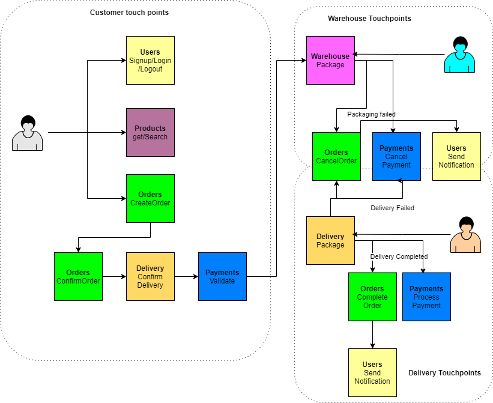

# **Microervices based System Redesign**
e-Commerce system engineering 

- [**Introduction**]

## **Introduction**
CloudSurfer Lmtd. Is a cloud
based web shop for surf and skate gear. They ship
to the whole of Europe to provide lovers of the sport of any level with equipment.

Customers of CloudSurfer can browse items and place their order through a web
interface or mobile application. Through logging into their account they can place
an order and choose between two delivery options: having it shipped directly to
their home address or delivery to a nearby pickup point. For both delivery options
a text message is sent upon arrival.

## **Problem Statement**
 To identify a simple (user) journey for which a microservices based
solution would be helpful. In your solution, use at least two microservices. 

Draw out a proposed software architecture and argue why and how it would be
beneficial to CloudSurfer. 
## **Current Implementation (Assumption)**
Currently the web shop is a monolith application hosted on the cloud. It consist of 3 layers . The company has been scaling verically to cater to the demand. 

Each release is requires testing of the complete application and hence release cycles are long.

## **User Journey**

Following is a simple user journey 

The Microservices used are
1. Users
2. Products
3. Orders
4. Delivery
5. Warehouse
6. Payments

## **Architecture Diagram based on AWS**

AWS Services used are
1. Route 53
2. Amplify
3. AWS Cognito
4. AWS S3
5. AWS S3 
6. AWS Lambda
7. AWS Dynamodb
8. Redis

